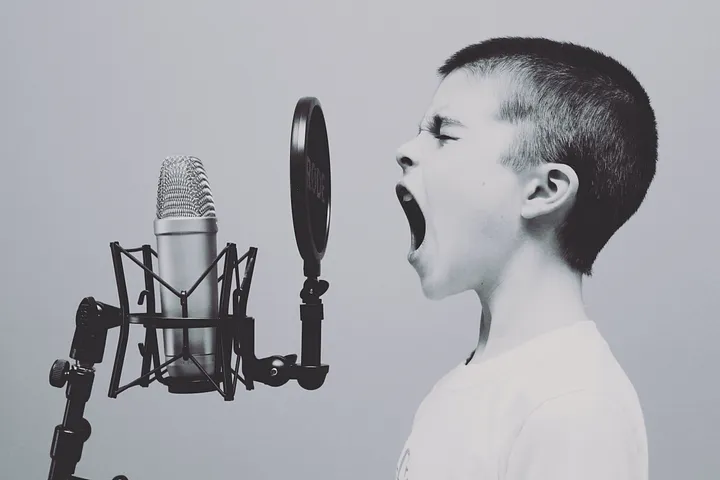

# Speech-Emotion-Recognition

<p align="center">


<a href="https://www.linkedin.com/in/md-minhaj-uddin-a072b4182/">
  
</a>
</p>

<p align="justify">Speech emotion recognition (SER) is a fascinating and rapidly evolving field within the broader domain of natural language processing (NLP) and human-computer interaction. It focuses on the development of algorithms and models capable of identifying and understanding the emotional content conveyed in spoken language. This technology holds significant promise for a wide range of applications, from improving customer service interactions to enhancing mental health support systems.

</p>
<h2 id="about_data"> About Dataset </h2>
<h4 id="context"> Context </h4>
<p align="justify">
Speech is the most natural way of expressing ourselves as humans. It is only natural then to extend this communication medium to computer applications. We define speech emotion recognition (SER) systems as a collection of methodologies that process and classify speech signals to detect the embedded emotions. SER is not a new field, it has been around for over two decades, and has regained attention thanks to the recent advancements. These novel studies make use of the advances in all fields of computing and technology, making it necessary to have an update on the current methodologies and techniques that make SER possible. We have identified and discussed distinct areas of SER, provided a detailed survey of current literature of each, and also listed the current challenges.
</p>
<h4 id="content"> Content </h4>
<p align="justify">
Here 4 most popular datasets in English: Crema, Ravdess, Savee and Tess. Each of them contains audio in .wav format with some main labels.<br/>
These datasets contain almost ```12261``` records combined. Details can be found in ```data``` folder.<br/>
</p>
<h2 id="model"> Used Models </h2>
<p align="justify">
In this project I used several models like Sequential with LSTM(256), Sequential with LSTM(128), Sequential with LSTM(CNN) but considering everything I deployed sequential with LSTM(128) for obtaining the audio features more precisely.
<a href="#">
    
  </a>
</p>
<h2 id="performance"> Models Performance </h2>

Models | Accuracy | Val_acc
--- | --- | ---
LSTM(256) | 0.7735 | 0.5442
LSTM(128) | 0.7182 | 0.5560
LSTM(CNN) | 0.5895 | 0.5469

<h2 id="deployment"> Model Deployment </h2>
<p align="justify">I deployed the model to HuggingFace Spaces Gradio App. The implementation can be found in ```app``` folder or [here](https://huggingface.co/spaces/minhaj-ripon/Speech_Emotion_Detector). </p><br/>
